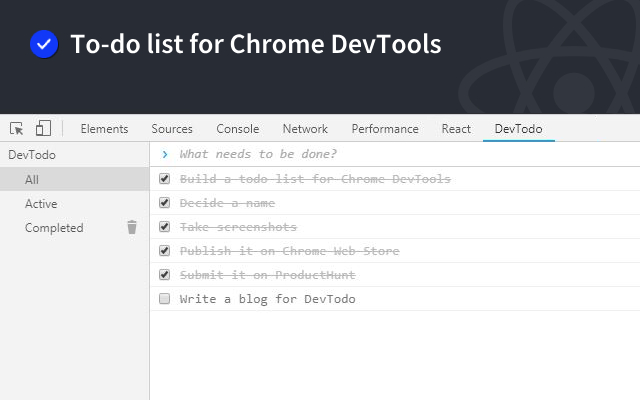

#  DevTodo

[link-cws]: https://chrome.google.com/webstore/detail/devtodo/oilcmhidpnogbcpnlbngnelnlngddhfg "Install"
[link-web]: https://dutiyesh.github.io/devtodo/ "DevTodo - Web"

> To-do list for Chrome Developer Tools

<table>
  <tr>
    <th width="50%">
      DevTodo - Light Theme
    </th>
    <th width="50%">
      DevTodo - Dark Theme
    </th>
  </tr>
  <tr><!-- Prevent zebra stripes --></tr>
  <tr>
    <td>
      
    </td>
    <td>
      
    </td>
  </tr>
</table>

<table>
  <tr>
    <th width="50%">
      DevTodo - Web
    </th>
  </tr>
  <tr><!-- Prevent zebra stripes --></tr>
  <tr>
    <td align="center">
      
    </td>
  </tr>
</table>

## Features

- Automatic syncing to any logged in Chrome browser
- Light and Dark Theme

## Install

[**Chrome** extension][link-cws]

## Web

Try [DevTodo - Web][link-web]

## Contribute

See the [contribution guide](contributing.md) and join the contributors.

## License

MIT &copy; Dutiyesh Salunkhe
